# Infrastructure Dependency Map

This guide follows a structured approach to building production infrastructure. Each section builds on previous ones, creating a robust foundation for your applications.

## Foundation Layer
The bedrock of your infrastructure - these have no dependencies and support everything else.

```mermaid
graph TD
    IAM["🔐 IAM<br/>Security Foundation"]
    VCS["📦 VCS<br/>Version Control"]
    CONFIG["⚙️ Application Configuration<br/>Config Management"]
    DEPS["📋 Application Dependencies<br/>System Dependencies"]

    style IAM fill:#e1f5fe
    style VCS fill:#e1f5fe
    style CONFIG fill:#e1f5fe
    style DEPS fill:#e1f5fe
```

## Infrastructure Layer
Core infrastructure components that depend on the foundation.

```mermaid
graph TD
    IAM["🔐 IAM"] --> NETWORK["🌐 Foundational Networking"]
    CONFIG["⚙️ Application Configuration"] --> OBS["📊 Observability"]
    CONFIG --> SERVICE["🔍 Service Discovery"]
    CONFIG --> SECRETS["🔑 Credential Management"]

    style NETWORK fill:#f3e5f5
    style OBS fill:#f3e5f5
    style SERVICE fill:#f3e5f5
    style SECRETS fill:#f3e5f5
```

## Application Layer
Application-specific infrastructure built on the core infrastructure.

```mermaid
graph TD
    VCS["📦 VCS"] --> ARTIFACTS["📦 Application Artifacts"]
    NETWORK["🌐 Foundational Networking"] --> ARTIFACTS
    NETWORK --> DB["🗄️ Database"]
    NETWORK --> WAF["🛡️ WAF & CDN"]
    NETWORK --> OVERLAY["🔗 Overlay Network"]
    CONFIG["⚙️ Application Configuration"] --> DB

    style ARTIFACTS fill:#fff3e0
    style DB fill:#fff3e0
    style WAF fill:#fff3e0
    style OVERLAY fill:#fff3e0
```

## Compute & Deployment Layer
Components for running and deploying applications.

```mermaid
graph TD
    ARTIFACTS["📦 Application Artifacts"] --> COMPUTE["💻 Application Compute"]
    ARTIFACTS --> CI["🔄 Continuous Integration"]
    CONFIG["⚙️ Application Configuration"] --> COMPUTE
    NETWORK["🌐 Foundational Networking"] --> COMPUTE
    NETWORK --> LB["⚖️ Load Balancer"]
    VCS["📦 VCS"] --> CI
    CI --> HEALTH["❤️ Health & Smoke Test"]
    HEALTH --> LB

    style COMPUTE fill:#e8f5e8
    style CI fill:#e8f5e8
    style HEALTH fill:#e8f5e8
    style LB fill:#e8f5e8
```

## Operational Layer
Production operations and monitoring.

```mermaid
graph TD
    VCS["📦 VCS"] --> CD["🚀 Continuous Deployment"]
    ARTIFACTS["📦 Application Artifacts"] --> CD
    HEALTH["❤️ Health & Smoke Test"] --> CD
    OBS["📊 Observability"] --> ALERTS["🚨 Alerts"]

    style CD fill:#fce4ec
    style ALERTS fill:#fce4ec
```

## Complete Dependency Flow

```mermaid
graph TB
    subgraph "Foundation Layer"
        IAM["🔐 IAM"]
        VCS["📦 VCS"]
        CONFIG["⚙️ Application Configuration"]
        DEPS["📋 Application Dependencies"]
    end

    subgraph "Infrastructure Layer"
        NETWORK["🌐 Foundational Networking"]
        OBS["📊 Observability"]
        SERVICE["🔍 Service Discovery"]
        SECRETS["🔑 Credential Management"]
    end

    subgraph "Application Layer"
        ARTIFACTS["📦 Application Artifacts"]
        DB["🗄️ Database"]
        WAF["🛡️ WAF & CDN"]
        OVERLAY["🔗 Overlay Network"]
    end

    subgraph "Compute & Deployment"
        COMPUTE["💻 Application Compute"]
        CI["🔄 Continuous Integration"]
        HEALTH["❤️ Health & Smoke Test"]
        LB["⚖️ Load Balancer"]
    end

    subgraph "Operations"
        CD["🚀 Continuous Deployment"]
        ALERTS["🚨 Alerts"]
    end

    %% Foundation dependencies
    IAM --> NETWORK
    CONFIG --> OBS
    CONFIG --> SERVICE
    CONFIG --> SECRETS

    %% Application dependencies
    VCS --> ARTIFACTS
    NETWORK --> ARTIFACTS
    NETWORK --> DB
    NETWORK --> WAF
    NETWORK --> OVERLAY
    CONFIG --> DB
    DEPS --> ARTIFACTS

    %% Compute dependencies
    ARTIFACTS --> COMPUTE
    ARTIFACTS --> CI
    CONFIG --> COMPUTE
    NETWORK --> COMPUTE
    NETWORK --> LB
    VCS --> CI
    CI --> HEALTH
    HEALTH --> LB

    %% Operations dependencies
    VCS --> CD
    ARTIFACTS --> CD
    HEALTH --> CD
    OBS --> ALERTS

    style IAM fill:#e1f5fe
    style VCS fill:#e1f5fe
    style CONFIG fill:#e1f5fe
    style DEPS fill:#e1f5fe
    style NETWORK fill:#f3e5f5
    style OBS fill:#f3e5f5
    style SERVICE fill:#f3e5f5
    style SECRETS fill:#f3e5f5
    style ARTIFACTS fill:#fff3e0
    style DB fill:#fff3e0
    style WAF fill:#fff3e0
    style OVERLAY fill:#fff3e0
    style COMPUTE fill:#e8f5e8
    style CI fill:#e8f5e8
    style HEALTH fill:#e8f5e8
    style LB fill:#e8f5e8
    style CD fill:#fce4ec
    style ALERTS fill:#fce4ec
```

## Getting Started

We recommend following this order:

1. **[IAM](/foundation/iam)** - Set up your security foundation
2. **[VCS](/foundation/vcs)** - Establish version control and collaboration
3. **[Application Configuration](/foundation/application-configuration)** - Set up configuration management
4. **[Foundational Networking](/infrastructure/foundational-networking)** - Create your network foundation
5. Continue through each layer in dependency order...

Each section includes:
- **Why it matters** - Understanding the importance
- **Our recommendation** - Specific tools and approaches
- **How to do it** - Step-by-step implementation
- **Alternatives** - Other options to consider
- **Dependencies** - What you need first
- **Dependents** - What builds on this